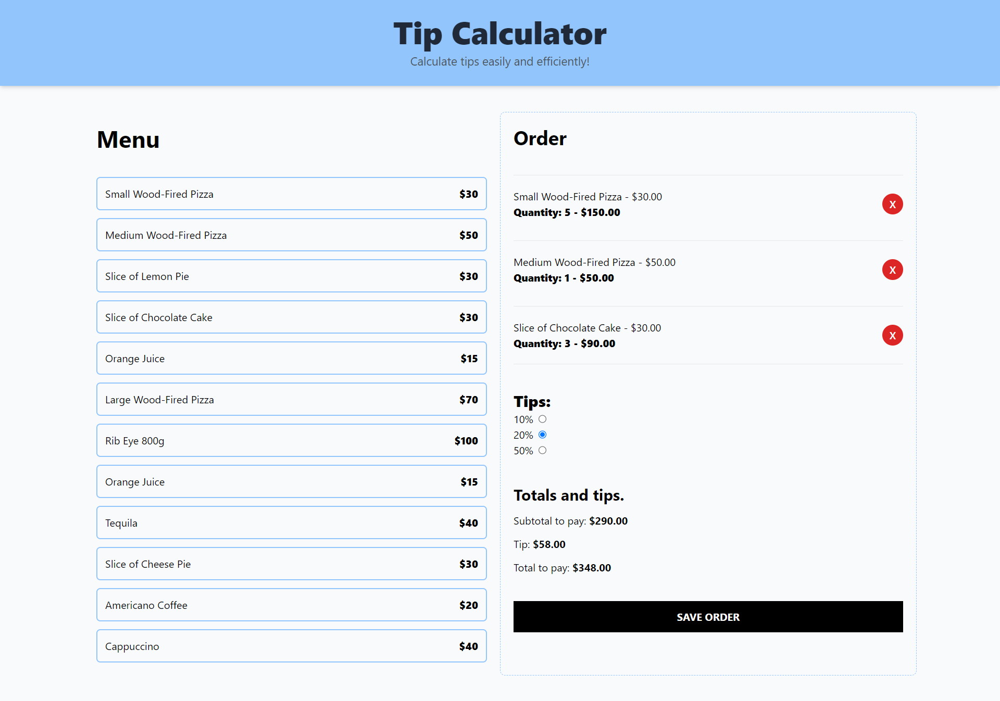

# Tip Calculator App

## Description
This is a tip calculator application built with React, TypeScript, and Tailwind CSS. It allows users to add dishes to their order, automatically calculate the total, and select a tip of 10%, 20%, or 50%. The total updates automatically based on the selected tip.

## Preview


## Features

- **Add Dishes**: Users can add menu items to their order.
- **Automatic Total Calculation**: The total is automatically calculated as items are added and the tip is selected.
- **Tip Selection**: Users can choose between a 10%, 20%, or 50% tip, and the total updates accordingly.
- **Order State Management**: The `useOrder` hook manages the order state and related functions.

## Technologies Used

- **React**: A library for building user interfaces.
- **TypeScript**: A superset of JavaScript that adds static types.
- **Tailwind CSS**: A CSS framework for creating custom designs.

## How to Run the Project

1. Clone the repository:
```bash
git clone https://github.com/AlfonsoVidrio/tip-calculator
```
2. Navigate to the project folder:
```bash
cd tip-calculator
```
3. Install the dependencies:
```bash
npm install
```
4. Run the application:
```bash
npm run dev
```